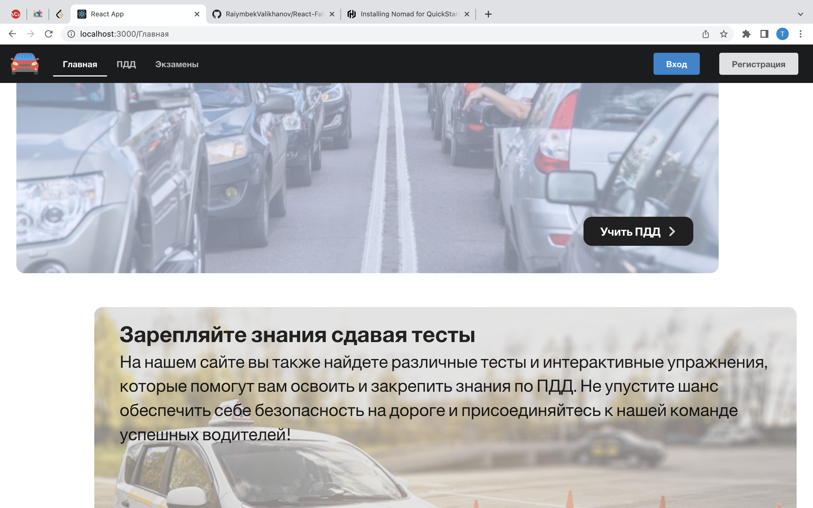
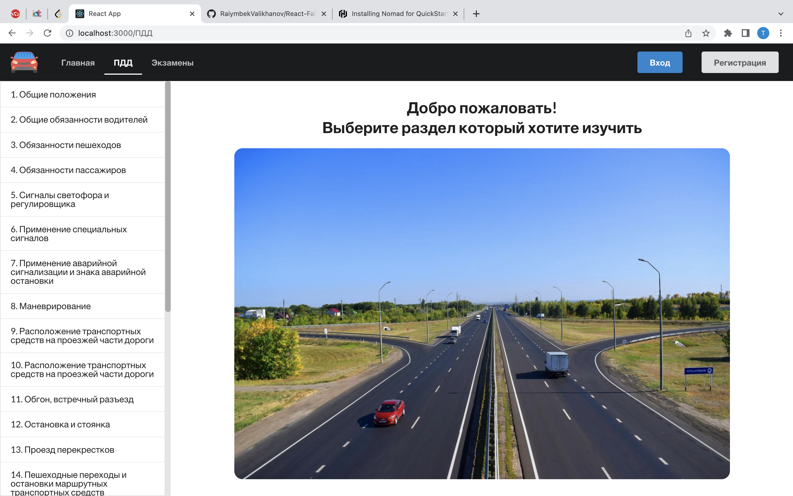
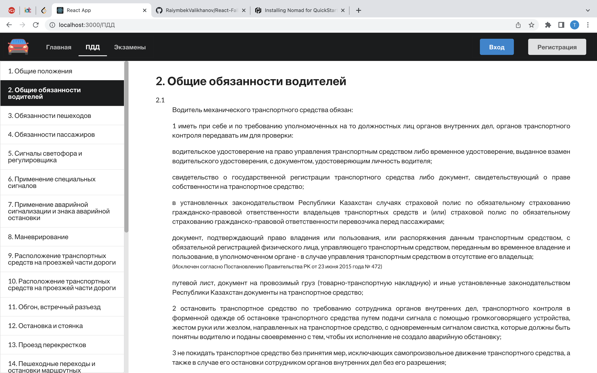
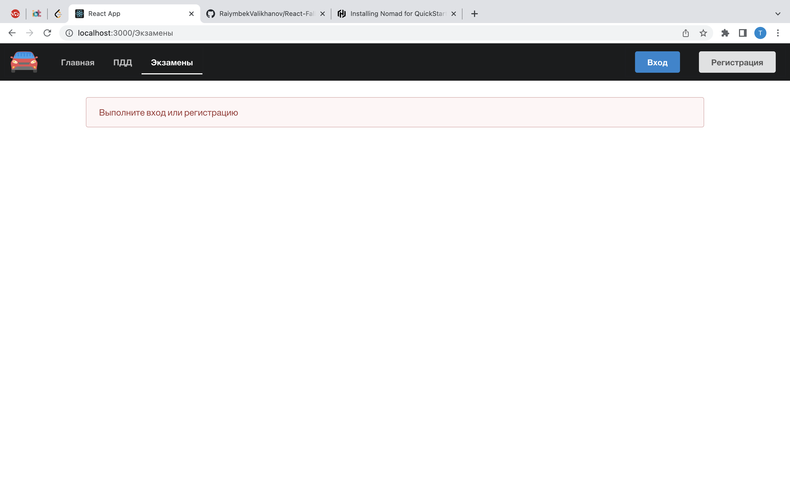
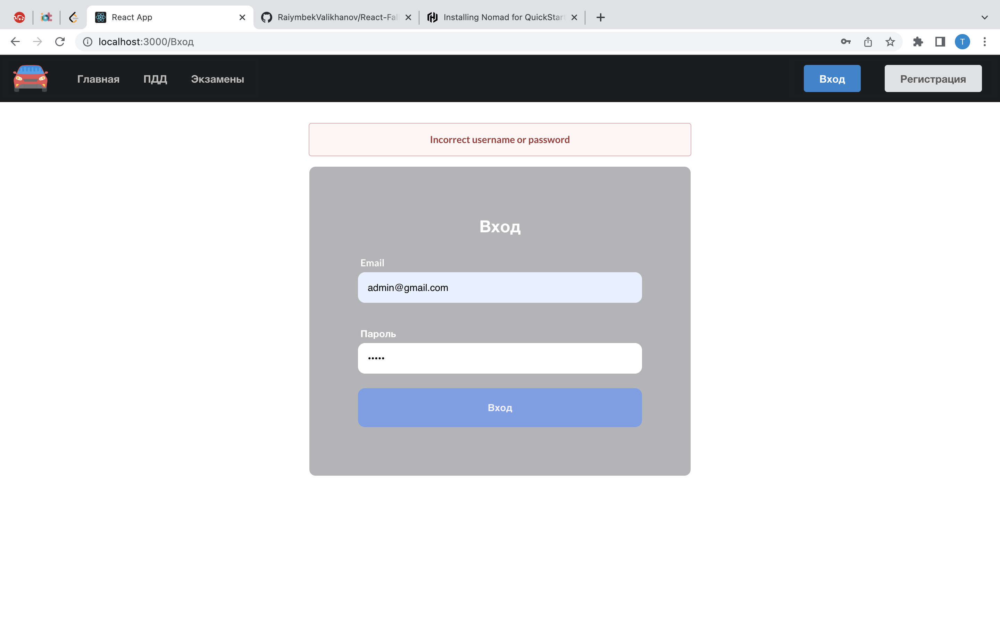
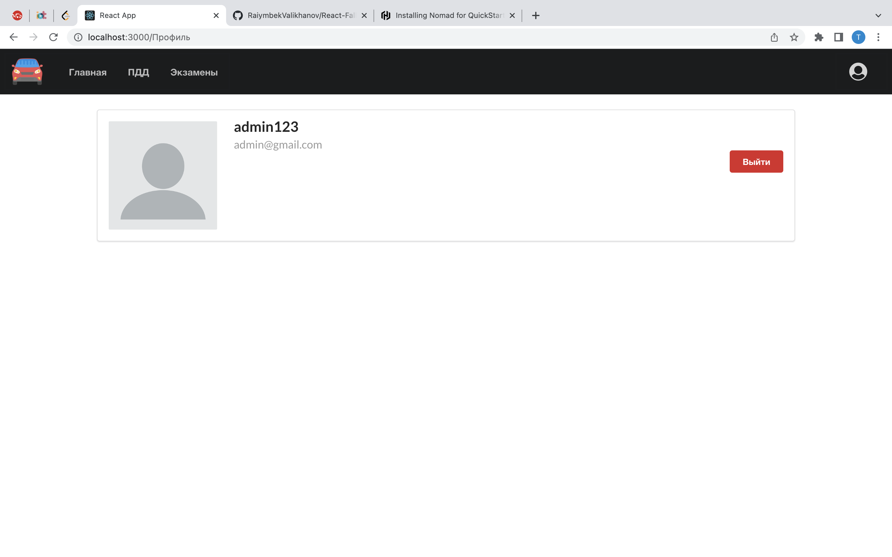
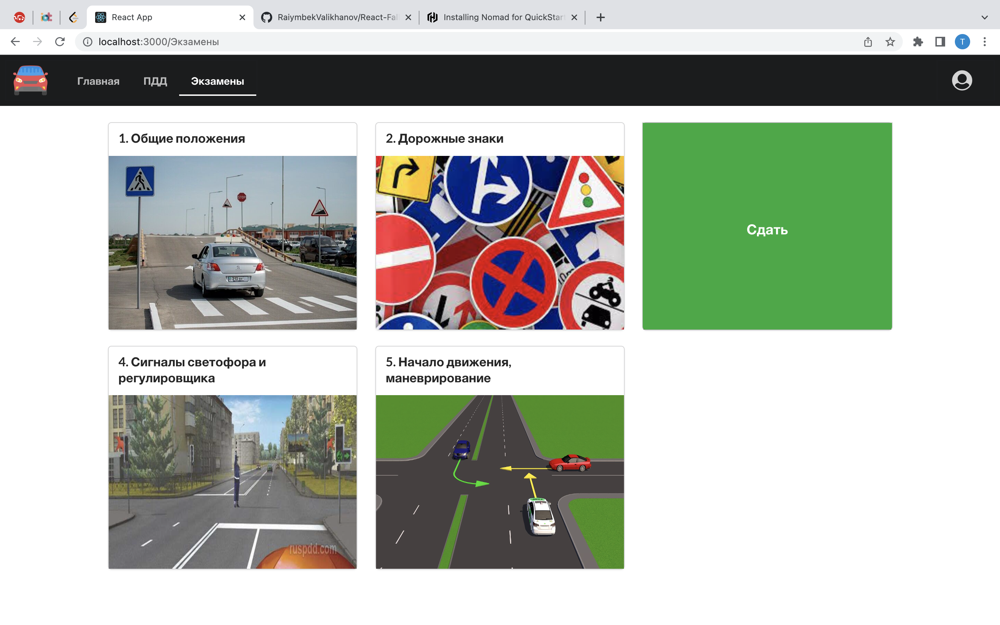
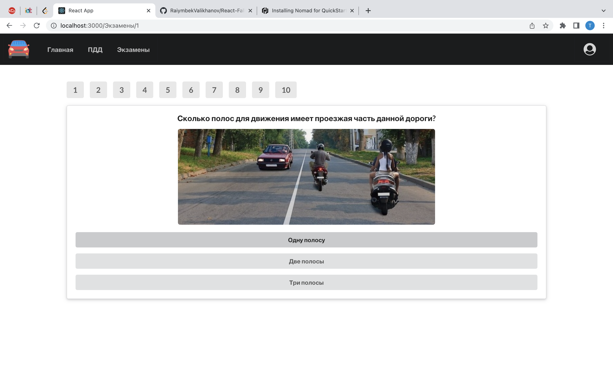
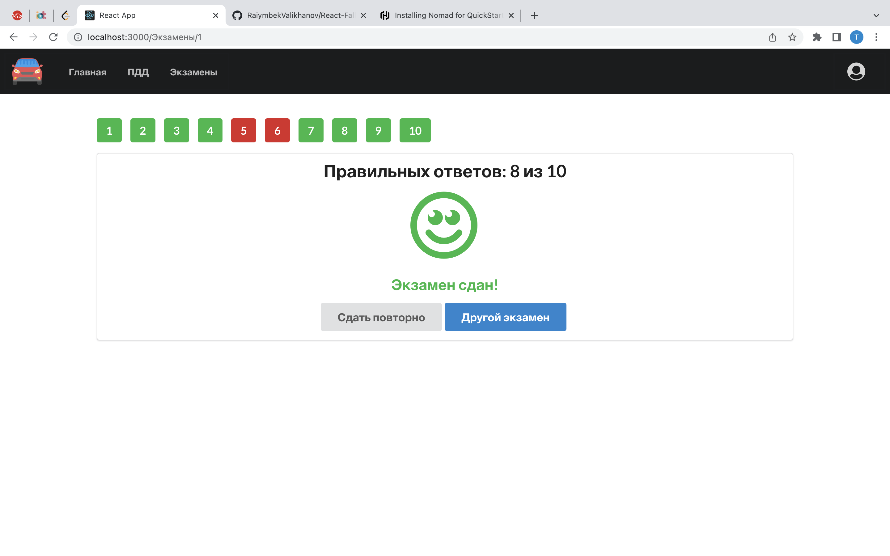

# React Fall 2022 Project
## Сайт ПДД
Сайт предназначен для изучения правил дорожного движения и закрепления знаний путем сдачи тестов. Пользователи могут изучать различные разделы ПДД и сдавать тесты по ним. Не авторизованные пользователи могут лишь читать правила. Авторизованные могут сдавать тесты, а также просматривать свой прогресс в профиле. 

#### Обязанности:
- Валиханов Райымбек - frontend, backend
- Разак Абдинур - frontend, design

#### Страницы:
- Главная страница 
- Страница ПДД  
- Страница тестов
- Страница определенного теста
- Форма входа/регистрации
- Страница пользователя

1. At least 4 pages &#9745;
2. Components, Props &#9745;
3. Components, State &#9745;
4. Lifecycle methods &#9745;
5. API Requests &#9745;
6. Hooks &#9745;
7. Navigation &#9745;
8. Context System &#9745;

**UI библиотека:** https://react.semantic-ui.com/
 
**Backend:** https://github.com/RaiymbekValikhanov/React-Fall-2022-Backend

### Страницы

